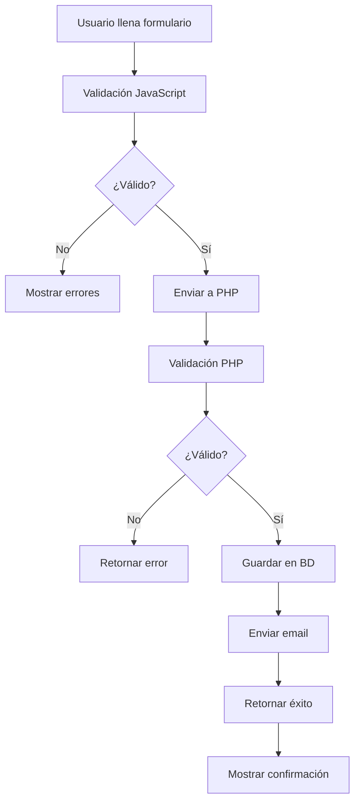

# Documentación del Sistema de Contacto - UWEB

## Resumen del Sistema

El sistema de contacto de UWEB está diseñado para capturar, procesar y gestionar las consultas de clientes potenciales a través de un formulario web integrado con una base de datos MySQL y un panel de administración PHP.

## Arquitectura del Sistema

```
Frontend (HTML/JS) → Backend PHP → Base de Datos MySQL → Panel Admin
```

### Componentes Principales

1. **Formulario de Contacto** (`contacto.html`)
2. **Validación JavaScript** (`script.js`)
3. **Procesador PHP** (`procesar_contacto.php`)
4. **Base de Datos MySQL** (`uweb_contactos`)
5. **Panel de Administración** (`admin/`)

## Funcionamiento del Formulario de Contacto

### Campos del Formulario

| Campo | Tipo | Requerido | Validación |
|-------|------|-----------|------------|
| `name` | text | Sí | Mínimo 2 caracteres |
| `email` | email | Sí | Formato de email válido |
| `phone` | tel | No | Formato telefónico internacional |
| `serviceType` | select | Sí | Opción válida del dropdown |
| `message` | textarea | Sí | Mínimo 10 caracteres |

### Opciones de Tipo de Servicio

- **estudio**: Estudio - Análisis y estrategia
- **diseno**: Diseño - UI/UX y prototipado
- **construccion**: Construcción - Desarrollo web
- **despliegue**: Despliegue - Lanzamiento y hosting
- **completo**: Proyecto completo (4 etapas)
- **other**: Otro

### Proceso de Validación

#### 1. Validación del Frontend (JavaScript)

```javascript
// Validaciones implementadas:
- Campo requerido: value.length > 0
- Email: /^[a-zA-Z0-9._%+-]+@[a-zA-Z0-9.-]+\.[a-zA-Z]{2,}$/
- Teléfono: /^(\+51\s?)?[9][0-9]{8}$|^[\+]?[0-9\s\-\(\)]{9,15}$/
- Longitud mínima: configurable por campo
```

**Estados de validación:**
- ✅ **success**: Campo válido (borde verde)
- ❌ **error**: Campo inválido (borde rojo + mensaje)
- ⚪ **neutral**: Sin validar

#### 2. Validación del Backend (PHP)

```php
// Validaciones del servidor:
- Sanitización de datos de entrada
- Validación de formato de email
- Verificación de longitud de campos
- Protección contra XSS e inyección SQL
- Verificación de CSRF token
```

### Flujo de Envío del Formulario



## Base de Datos MySQL

### Estructura de la Tabla `contactos`

```sql
CREATE TABLE contactos (
    id INT AUTO_INCREMENT PRIMARY KEY,
    nombre VARCHAR(100) NOT NULL,
    email VARCHAR(150) NOT NULL,
    telefono VARCHAR(20),
    tipo_servicio ENUM('estudio', 'diseno', 'construccion', 'despliegue', 'completo', 'other') NOT NULL,
    mensaje TEXT NOT NULL,
    fecha_envio TIMESTAMP DEFAULT CURRENT_TIMESTAMP,
    ip_cliente VARCHAR(45),
    user_agent TEXT,
    estado ENUM('nuevo', 'leido', 'respondido', 'archivado') DEFAULT 'nuevo',
    notas_admin TEXT,
    fecha_respuesta TIMESTAMP NULL,
    respondido_por VARCHAR(50),
    prioridad ENUM('baja', 'media', 'alta', 'urgente') DEFAULT 'media',
    origen VARCHAR(50) DEFAULT 'web',
    INDEX idx_fecha (fecha_envio),
    INDEX idx_estado (estado),
    INDEX idx_email (email)
);
```

### Campos Adicionales para Administración

- **estado**: Control del flujo de trabajo
- **notas_admin**: Comentarios internos
- **fecha_respuesta**: Timestamp de respuesta
- **respondido_por**: Usuario que respondió
- **prioridad**: Nivel de urgencia
- **origen**: Fuente del contacto

## Archivos del Sistema Backend

### 1. Configuración de Base de Datos (`config/database.php`)

```php
<?php
// Configuración de conexión a MySQL
define('DB_HOST', 'localhost');
define('DB_NAME', 'uweb_contactos');
define('DB_USER', 'uweb_user');
define('DB_PASS', 'password_seguro');
define('DB_CHARSET', 'utf8mb4');

// Configuración de email
define('SMTP_HOST', 'smtp.gmail.com');
define('SMTP_PORT', 587);
define('SMTP_USER', 'info@uweb.com');
define('SMTP_PASS', 'app_password');
define('ADMIN_EMAIL', 'admin@uweb.com');
```

### 2. Procesador Principal (`procesar_contacto.php`)

**Funcionalidades:**
- Validación y sanitización de datos
- Inserción en base de datos
- Envío de emails de confirmación
- Notificación al administrador
- Respuesta JSON al frontend

### 3. Panel de Administración (`admin/`)

**Estructura de archivos:**
```
admin/
├── index.php              # Dashboard principal
├── login.php              # Sistema de autenticación
├── contactos.php          # Lista de contactos
├── ver_contacto.php       # Detalle de contacto
├── responder.php          # Formulario de respuesta
├── estadisticas.php       # Reportes y métricas
├── config.php             # Configuración del admin
├── includes/
│   ├── header.php         # Header común
│   ├── footer.php         # Footer común
│   └── functions.php      # Funciones auxiliares
├── assets/
│   ├── css/admin.css      # Estilos del admin
│   └── js/admin.js        # JavaScript del admin
└── exports/               # Archivos de exportación
```

## Funcionalidades del Panel de Administración

### Dashboard Principal

**Métricas mostradas:**
- 📊 Total de contactos (hoy, semana, mes)
- 📈 Tasa de respuesta
- ⏱️ Tiempo promedio de respuesta
- 🎯 Servicios más solicitados
- 📍 Distribución geográfica (por IP)

### Gestión de Contactos

**Funcionalidades disponibles:**
- ✅ Ver lista paginada de contactos
- 🔍 Búsqueda y filtros avanzados
- 👁️ Ver detalles completos
- ✉️ Responder directamente
- 🏷️ Cambiar estado y prioridad
- 📝 Agregar notas internas
- 📤 Exportar a CSV/Excel

### Filtros Disponibles

- **Por estado**: Nuevo, Leído, Respondido, Archivado
- **Por fecha**: Hoy, Última semana, Último mes, Rango personalizado
- **Por servicio**: Todos los tipos de servicio
- **Por prioridad**: Baja, Media, Alta, Urgente
- **Por texto**: Búsqueda en nombre, email o mensaje

### Sistema de Notificaciones

**Notificaciones automáticas:**
- 📧 Email al admin por cada nuevo contacto
- 🔔 Alertas de contactos sin responder (24h)
- 📊 Reporte semanal de actividad
- ⚠️ Alertas de contactos de alta prioridad

## Seguridad Implementada

### Frontend
- ✅ Validación de campos en tiempo real
- ✅ Sanitización de inputs
- ✅ Protección contra spam (rate limiting)
- ✅ CSRF token en formularios

### Backend
- ✅ Prepared statements (previene SQL injection)
- ✅ Validación y sanitización de datos
- ✅ Escape de output (previene XSS)
- ✅ Autenticación segura para admin
- ✅ Logs de actividad
- ✅ Limitación de intentos de login

### Base de Datos
- ✅ Usuario con permisos limitados
- ✅ Conexión encriptada (SSL)
- ✅ Backups automáticos
- ✅ Índices optimizados

## Configuración del Hosting

### Requisitos del Servidor

**Mínimos:**
- PHP 7.4 o superior
- MySQL 5.7 o superior
- Extensiones PHP: mysqli, PDO, mail, json
- SSL/TLS habilitado
- Espacio: 100MB mínimo

**Recomendados:**
- PHP 8.1+
- MySQL 8.0+
- Servidor web: Apache/Nginx
- Memoria: 256MB+
- Backup automático

### Variables de Entorno

```bash
# Archivo .env (no incluir en repositorio)
DB_HOST=localhost
DB_NAME=uweb_contactos
DB_USER=uweb_user
DB_PASS=tu_password_seguro
ADMIN_USER=admin
ADMIN_PASS=admin_password_seguro
SMTP_HOST=smtp.gmail.com
SMTP_USER=info@uweb.com
SMTP_PASS=tu_app_password
```

## Instalación y Configuración

### Paso 1: Subir Archivos
```bash
# Estructura en el servidor
public_html/
├── contacto.html
├── procesar_contacto.php
├── config/
├── admin/
└── assets/
```

### Paso 2: Crear Base de Datos
```sql
-- Ejecutar en phpMyAdmin o consola MySQL
CREATE DATABASE uweb_contactos CHARACTER SET utf8mb4 COLLATE utf8mb4_unicode_ci;
CREATE USER 'uweb_user'@'localhost' IDENTIFIED BY 'password_seguro';
GRANT SELECT, INSERT, UPDATE ON uweb_contactos.* TO 'uweb_user'@'localhost';
FLUSH PRIVILEGES;
```

### Paso 3: Configurar Email
- Configurar SMTP en el hosting
- Crear app password para Gmail
- Verificar envío de emails de prueba

### Paso 4: Configurar Admin
- Cambiar credenciales por defecto
- Configurar permisos de archivos
- Probar acceso al panel

## Mantenimiento y Monitoreo

### Tareas Diarias
- ✅ Revisar nuevos contactos
- ✅ Responder consultas pendientes
- ✅ Verificar funcionamiento del formulario

### Tareas Semanales
- ✅ Revisar logs de errores
- ✅ Backup de base de datos
- ✅ Análisis de métricas

### Tareas Mensuales
- ✅ Limpiar contactos antiguos archivados
- ✅ Actualizar estadísticas
- ✅ Revisar seguridad

## Métricas y Reportes

### KPIs Principales
- **Tasa de conversión**: Contactos → Clientes
- **Tiempo de respuesta**: Promedio de respuesta
- **Satisfacción**: Feedback de respuestas
- **Origen de tráfico**: Fuentes de contactos

### Reportes Disponibles
- 📊 Reporte diario de contactos
- 📈 Análisis semanal de tendencias
- 📋 Reporte mensual ejecutivo
- 📤 Exportación de datos

## Solución de Problemas Comunes

### Formulario no envía
1. Verificar JavaScript habilitado
2. Revisar conexión a base de datos
3. Comprobar configuración de email
4. Verificar logs de PHP

### Emails no llegan
1. Verificar configuración SMTP
2. Revisar spam/junk folder
3. Comprobar límites del hosting
4. Verificar DNS y SPF records

### Panel admin no carga
1. Verificar permisos de archivos
2. Revisar configuración de base de datos
3. Comprobar logs de errores
4. Verificar credenciales de acceso

---

**Fecha de creación:** Noviembre 2024  
**Versión:** 1.0  
**Próxima actualización:** Enero 2025